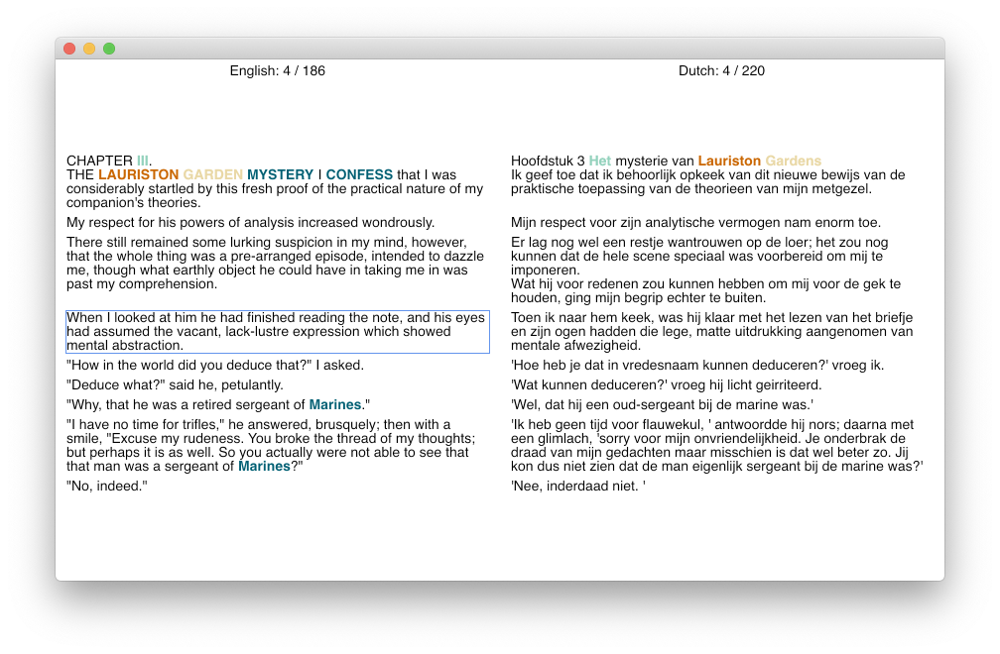

# Nederlands-Engels

A small program to match English sentences with their Dutch translations.



https://user-images.githubusercontent.com/3943804/236040192-9f787d4a-de6a-4d27-8047-2e53c6f622de.mp4

The tool is built using the [Avalonia](https://github.com/AvaloniaUI/Avalonia) UI Framework and a functional wrapper around it — [FuncUI](https://github.com/fsprojects/Avalonia.FuncUI).

## Usage

Only keyboard navigation is supported.

Hotkeys:

- `←` to move to the English sentence
- `→` to move to the Dutch sentence
- `↑` to move to the previous sentence
- `↓` to move to the next sentence
- `m` to merge the currently selected sentence with the previous one
- `u`/`r` to undo/redo last changes
- `Esc`/`q` to save the current state and quit

Repository also contains three chapters of the "A Study in Scarlet" book by Arthur Conan Doyle and their translations to Dutch.

## Building

```shell
# Clone the repository and its submodules
git clone --recurse-submodules git@github.com:Thecentury/nederlands-engels.git
cd nederlands-engels/NederlandsEngels.Gui
# Build the application
dotnet build
# Run it
dotnet run
```
